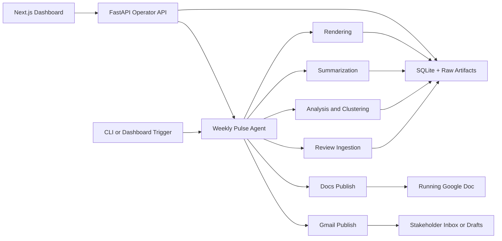

# Weekly Product Review Pulse - Detailed Architecture

## 1. System Goal

This project is an AI agent that:

1. ingests recent App Store and Google Play reviews for configured products
2. clusters and summarizes the feedback into a weekly pulse
3. renders a Docs section payload and a Gmail payload
4. appends the report to a running Google Doc
5. drafts or sends the stakeholder notification email
6. exposes an internal operator API and dashboard for status, readiness, and manual triggers

The canonical stakeholder artifact is the Google Doc, not the dashboard and not the email body.

## 2. Core Architecture Rules

- One agent runtime owns ingestion, reasoning, rendering, and delivery orchestration.
- Delivery is Google-workspace-first: Docs append happens before Gmail.
- The Google Doc is the system of record for each product.
- Runs are deterministic by `product_key + iso_week`.
- Re-running the same week must not duplicate the Docs section or Gmail delivery.
- Reviews are untrusted input and must be treated as data, not instructions.
- The operator dashboard is internal-only and exists to observe and trigger flows.

## 3. Major Components

| Component | Responsibility |
| --- | --- |
| `agent/__main__.py` | CLI entrypoints for phase commands, weekly runs, API serving, and local auth bootstrap |
| `agent/orchestrator.py` | checkpoint-aware end-to-end pipeline execution |
| `agent/ingestion/` | App Store and Google Play fetch, normalize, scrub, dedupe |
| `agent/analysis/` | preprocessing, embeddings, clustering, representative review selection |
| `agent/summarization/` | grounded theme generation, quote validation, action ideas |
| `agent/rendering/` | Docs append payload and Gmail render artifacts |
| `agent/mcp/` | delivery clients plus the FastAPI operator and Google helper server |
| `agent/storage.py` | SQLite persistence, artifacts, run history, delivery audit |
| `frontend/` | Next.js operator dashboard for status and trigger buttons |

## 4. High-Level Flow

## 5. Runtime Boundaries

### 5.1 Backend

The backend is a Python runtime that currently exposes:

- CLI commands through `pulse`
- a FastAPI server through `pulse serve`
- Google helper endpoints for Docs and Gmail delivery
- operator endpoints for health, overview, recent runs, job status, and manual triggers

### 5.2 Frontend

The operator console is a Next.js app under `frontend/`.

It currently reads:

- `GET /health`
- `GET /api/overview`
- `GET /api/runs`
- `GET /api/jobs`
- `GET /api/completion`

and triggers:

- `POST /api/trigger/run`
- `POST /api/trigger/weekly`

### 5.3 Google Delivery Boundary

The target architecture is MCP-based Google delivery.

Current code status:

- the repo has Google delivery wrappers and an internal FastAPI Google helper
- the helper performs Docs and Gmail actions once valid OAuth credentials are present
- live delivery is blocked until a valid authorized token is supplied

Important honesty note:

- the current repository does not yet use the external `@a-bonus/google-docs-mcp` stdio package as its active runtime delivery path
- because of that, pure external-MCP compliance is not fully complete yet
- the codebase is functionally ready for live Docs and Gmail delivery after auth, but the delivery boundary is still implemented through the built-in helper server in this workspace

## 6. Storage and Artifacts

Core tables:

- `products`
- `runs`
- `reviews`
- `review_embeddings`
- `clusters`
- `reports`
- `delivery_events`

Primary artifacts:

- `data/raw/<product>/<run_id>.jsonl`
- `data/artifacts/<run_id>/clusters.json`
- `data/summaries/<run_id>.json`
- `data/rendered/<run_id>/doc_payload.json`
- `data/rendered/<run_id>/email.html`
- `data/rendered/<run_id>/email.txt`

These support:

- deterministic reruns
- auditability
- checkpoint resume
- partial failure recovery

## 7. Idempotency Rules

### 7.1 Run Identity

- `run_id` is deterministic from product and ISO week
- each product plus week maps to one durable run row

### 7.2 Docs Publish

- one running Doc per product
- one stable section anchor per product plus ISO week
- append becomes a no-op if the anchor already exists

### 7.3 Gmail Publish

- Gmail depends on a confirmed Docs deep link
- the agent searches for the current run id before drafting or sending
- draft mode is the safe default while `PULSE_CONFIRM_SEND=false`

## 8. Operator Surface

The dashboard is not a reporting artifact. It is an operations console.

It exists to:

- see whether Google auth is present
- inspect recent run history
- inspect queued and in-flight jobs
- trigger a single product run
- trigger a weekly batch run

## 9. Current Workspace Audit

Audit date: 2026-04-25

What is implemented and verified in this workspace:

- backend tests pass
- CLI phase commands exist
- the checkpoint-aware orchestrator exists
- the FastAPI operator API responds
- the Next.js dashboard builds successfully
- INDMoney product config now points to:
  - App Store id `1450178837`
  - Play Store package `in.indwealth`
  - stakeholder email `gptshivam595@gmail.com`

What is not yet proven live in this workspace today:

- a fresh end-to-end Docs append with current Google credentials
- a fresh end-to-end Gmail draft or send with current Google credentials

Why that last step is still blocked:

- the code needs a valid authorized Google token at `token.json` or `GOOGLE_MCP_TOKEN_JSON`
- until that token exists, phases 5 and 6 are code-complete but not live-complete

## 10. Final Architecture Statement

The intended system is:

`one AI agent that analyzes app reviews, appends the weekly report into a running Google Doc, drafts or sends Gmail notifications, and exposes an internal dashboard for operators.`

The current repo now includes the operator API and dashboard. The remaining live-delivery dependency is Google OAuth token availability.
